# AWS IoT User Manual

The AWS IoT allows for secure bidirectional communication between the AWS cloud and devices (such as sensors, actuators, embedded microcontrollers, and smart devices) connected to the Internet, so that you can collect, store, and analyze telemetering data from devices.

The edge computing gateway InGateway902 (IG902 for short) provides the Device Supervisor app (Device Supervisor for short) to help users connect their devices to the AWS IoT. This document uses IG902 as an example to describe how to submit service data and deliver configuration data between the Device Supervisor and the AWS IoT. For details about the AWS usage restrictions, see [AWS Service Quota](https://docs.aws.amazon.com/zh_cn/general/latest/gr/aws_service_limits.html#limits_iot).

  - [Prerequisites](#prerequisites)
  - [1. Environment Preparation](#environmental-preparation)
    - [1.1 Configuring the AWS IoT](#aws-iot-configuration)
      - [1.1.1 Creating Things](#create-thing)
      - [1.1.2 Creating the Policy](#create-strategy)
      - [1.1.3 Configuring the Certificate](#configure-certificate)
    - [1.2 Configuring the Edge Computing Gateway](#edge-computing-gateway-configuration)
      - [1.2.1 Basic Configuring](#basic-configuration)
      - [1.2.2 Data Collecting Configuration](#configure-data-collection)
  - [2. Message Publishing and Subscription](#start-test)
    - [2.1 Connecting to the AWS IoT](#connect-to-aws-iot)
    - [2.2 Publishing Messages to the AWS IoT](#publish-to-aws-iot)
    - [2.3 Subscribing to AWS IoT Messages](#subscrip-aws-iot)
  - [Appendix](#appendix)
    - [Device Supervisor AWS IoT API Description](#aws-iot-api-interface-description-of-device-supervisor)

<a id="prerequisites"> </a>

## Prerequisites

- AWS cloud platform account
- Edge computing gateway IG501/IG902
  - Firmware version
    - IG902: `IG9-V2.0.0.r12754` or later
    - IG501: `IG5-V2.0.0.r12884` or later
  - SDK version
    - IG902: `py3sdk-V1.4.0_Edge-IG9` or later
    - IG501: `py3sdk-V1.4.0_Edge-IG5` or later
  - App version: `device_supervisor-V1.2.5` or later

<a id="environmental-preparation"> </a>

## 1. Environment Preparation

- [1.1 Configuring the AWS IoT](#aws-iot-configuration)
- [1.2 Configuring the Edge Computing Gateway](#edge-computing-gateway-configuration)

<a id="aws-iot-configuration"> </a>

### 1.1 Configuring the AWS IoT

- [1.1.1 Creating Objects](#create-thing)
- [1.1.2 Creating the Policy](#create-strategy)
- [1.1.3 Configuring the Certificate](#configure-certificate)

If you have configured the things, policy, and certificate in the AWS IoT console, go to [1.2 Configuring the Edge Computing Gateway](#edge-computing-gateway-configuration). Otherwise, perform the following steps to configure the AWS IoT console.   
Visit https://aws.amazon.com/, log in to the IoT console, and choose **IoT Core**.


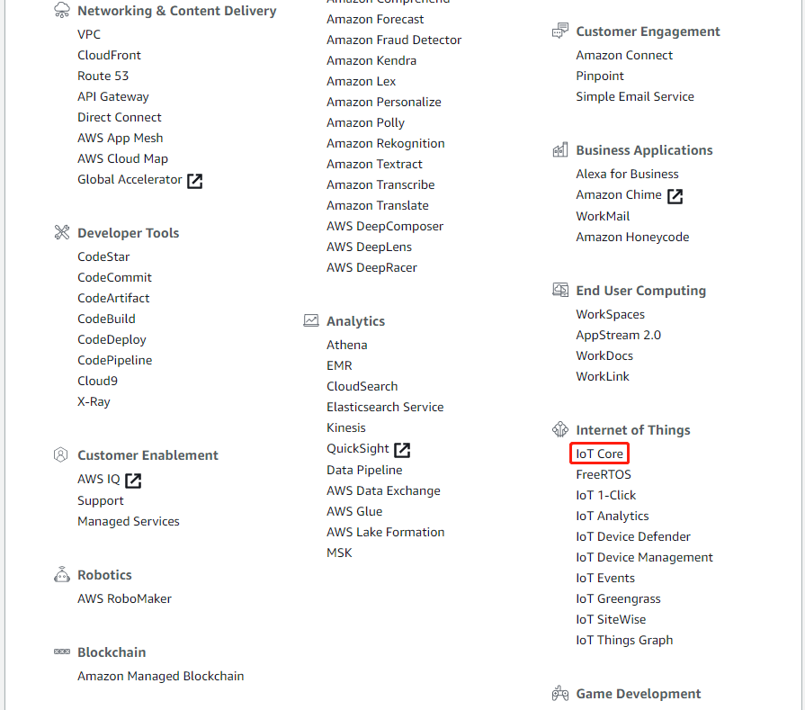

The following page appears after you log in to **IoT Core**:

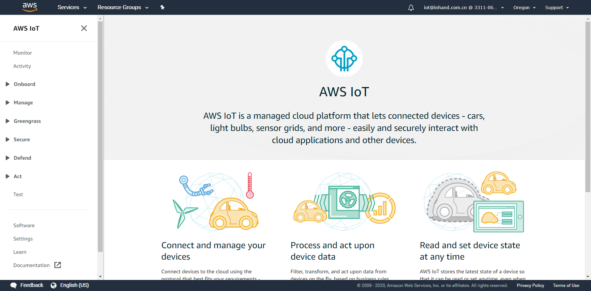

<a id="create-thing"> </a>

#### 1.1.1 Creating Things

Choose **Manage > Things** and click **Create**.

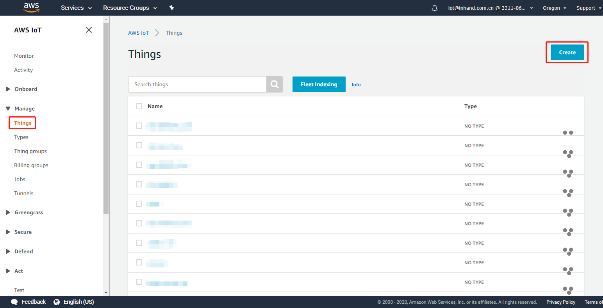

Click **Create a single thing**.

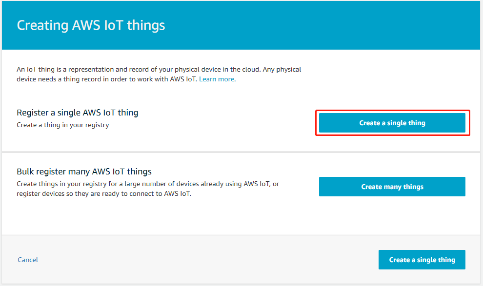

Set the thing name, for example, `aws_iot_test`, retain the default values for other parameters, and then click **Next**.

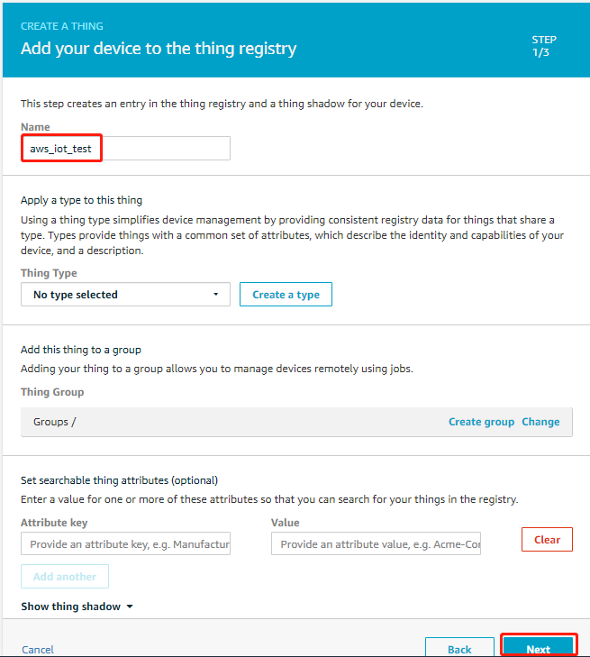

Click **Create certificate**.


<a id="download-file"> </a>

After the certificate is created, you need to download the certificate for this thing, the private key, and the root CA of the AWS IoT, activate the certificate, and then click **Done**. It is recommended that you download `Amazon Root CA 1` or `Starfield Starfield root CA certificate` when downloading the root CA certificate. <font color=#FF0000>Currently, the Amazon Root CA 3 certificate is not supported.</font>

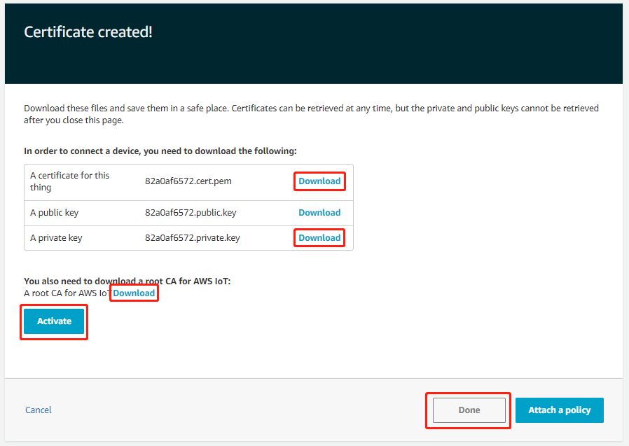


After the thing is created, the following page is displayed:

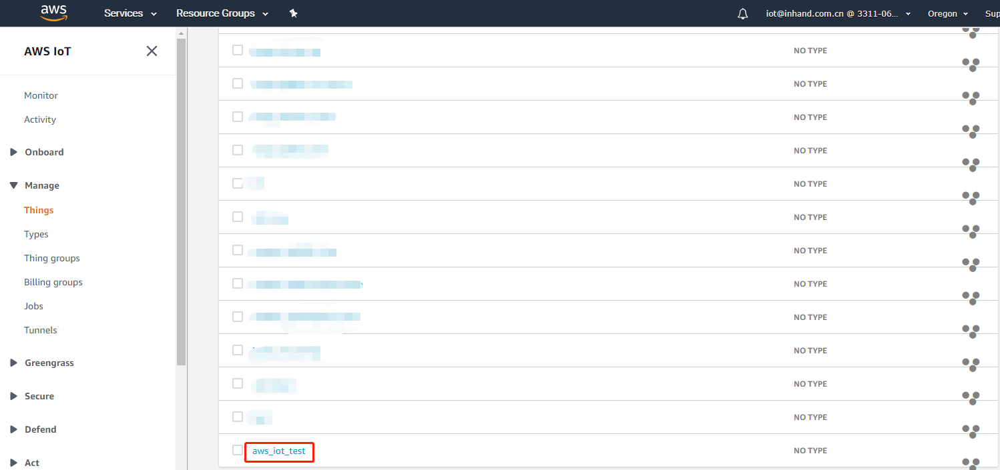

<a id="create-strategy"> </a>

#### 1.1.2 Creating the Policy

Choose **Secure > Policies** and click **Create**.

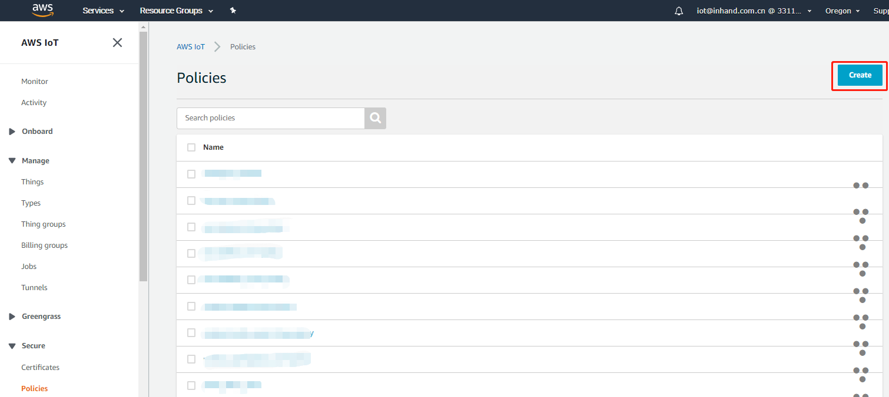

On the **Create a policy** page, enter the policy name, configure the policy by referring to the following settings, and then click **Create**. This policy allows all clients to connect to the AWS IoT.

- Enter `iot:*` in the Action text box.
- Enter `*` in the Resource ARN text box.
- Select **Allow** for **Effect**.


After the policy is created, the following page is displayed:


<a id="configure-certificate"> </a>

#### 1.1.3 Configuring the Certificate

Choose **Secure > Certificates**. The following page is displayed:

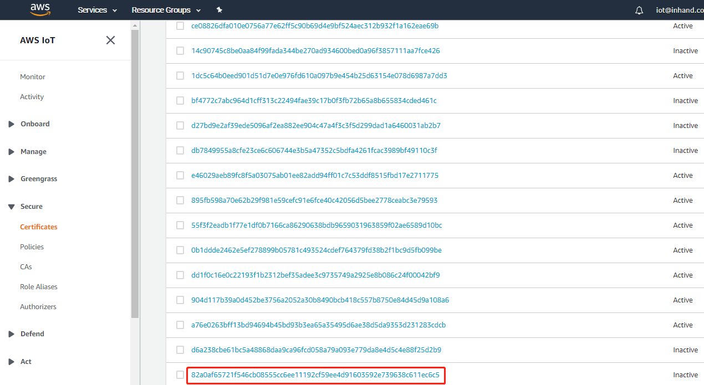

- Attaching a policy
  
  Click **...** to the right of the certificate and choose **Attach policy** to attach a policy to the certificate.
  
  
  
  Select the policy that you have created, and click **Attach**.
  
  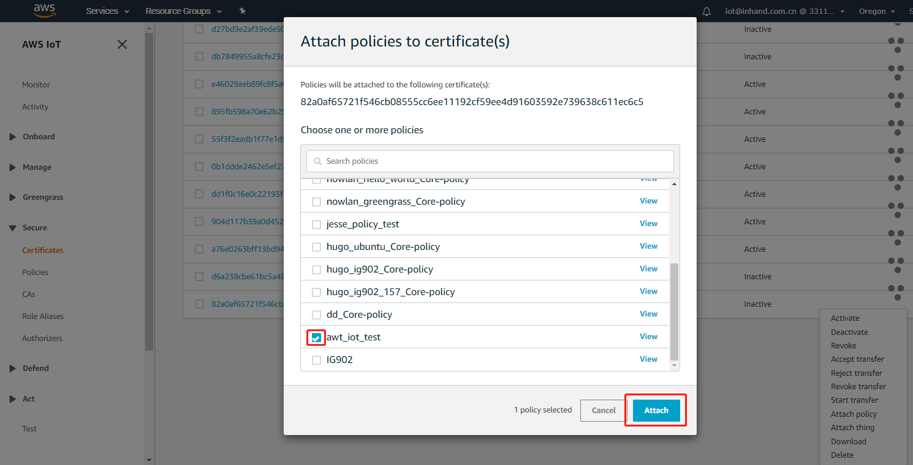
  
  After the policy is attached, the following page is displayed:
  
  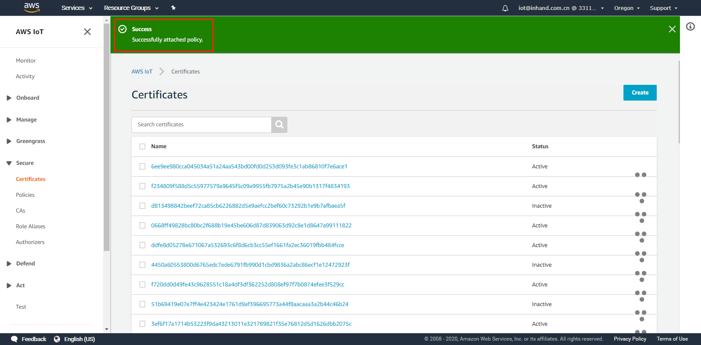

- Attaching a thing
  
  Click **...** to the right of the certificate and choose **Attach thing** to attach a thing to the certificate.
  
  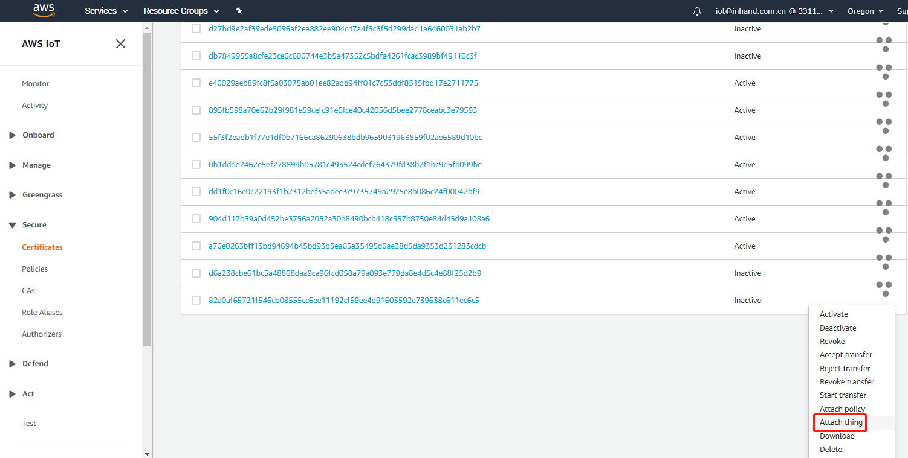
  
  Select the thing that you have created, and click **Attach**.
  
  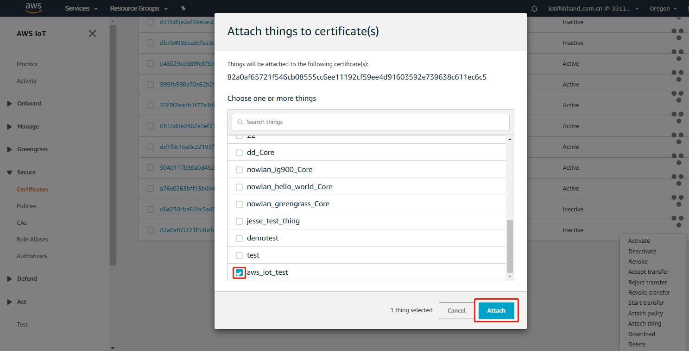
  
  After the thing is attached, the following page is displayed:
  
  

The preparation of the AWS IoT environment is completed.

<a id="edge-computing-gateway-configuration"> </a>

### 1.2 Configuring the Edge Computing Gateway

- [1.2.1 Basic Configuring](#basic-configuration)
- [1.2.2 Data Collecting Configuration](#configure-data-collection)

<a id="basic-configuration"> </a>

#### 1.2.1 Basic Configuring

For details about IG902 connection configuration and software version update, see [IG902 Quick Guide](http://manual.ig.inhandnetworks.com/en/latest/IG902-Quick-Start-Manual.html).

<a id="configure-data-collection"> </a>

#### 1.2.2 Data Collecting Configuration

For details about the basic data collection configuration for the Device Supervisor, see [Device Supervisor App User Manual](http://app.ig.inhandnetworks.com/en/latest/Device-Supervisor-User-Manual-EN.html). The following figure shows the data collection configuration in this document:


<a id="start-test"> </a>

## 2. Message Publishing and Subscription

- [2.1 Connecting to the AWS IoT](#connect-to-aws-iot)
- [2.2 Publishing Messages to the AWS IoT](#publish-to-aws-iot)
- [2.3 Subscribing to AWS IoT Messages](#subscrip-aws-iot)

<font color=#FF0000>The topics that start with a dollar sign ($) are reserved for the AWS IoT. You can subscribe to and publish messages to these topics. However, you cannot create topics with a “$” prefix. Prohibited message publishing or subscription for the reserved topics may cause connection failures. For details about the topics reserved for the AWS IoT, see [Reserved Topics](https://docs.aws.amazon.com/zh_cn/iot/latest/developerguide/reserved-topics.html).</font>

<a id="connect-to-aws-iot"> </a>

### 2.1 Connecting to the AWS IoT

Choose **Edge Computing > Device Supervisor > Cloud** on IG902, select **Enable Cloud Service**, and select **AWS IoT** from the Type drop-down list. The following is a configuration example:

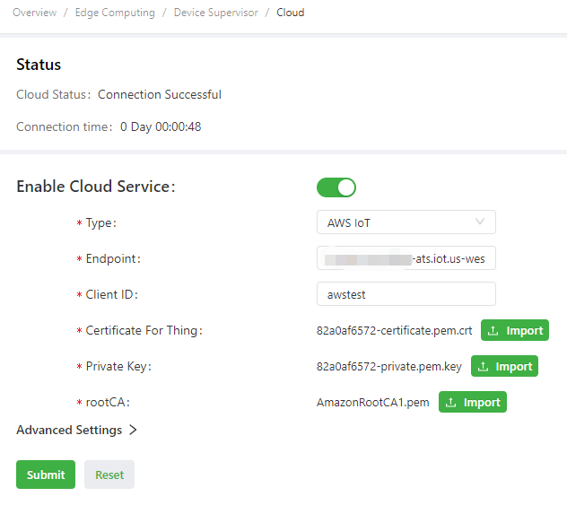

The parameters are described as follows:

- `Type`: select **AWS IoT** for an AWS IoT connection.

- `Endpoint`: endpoint address of the AWS IoT, which can be obtained from the **Settings** page of the AWS IoT. <font color=#FF0000>If the VeriSign Class 3 Public Primary G5 root CA certificate is used, you need to delete “-ats” from the address.</font>
  
  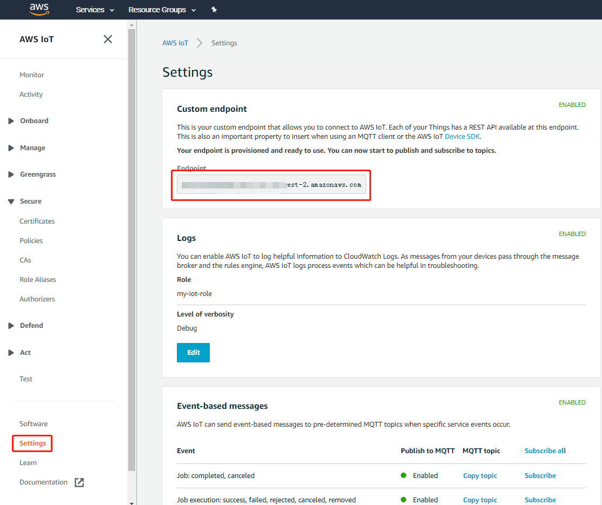

- `Client ID`: any unique ID.

- `Certificate For Thing`: thing certificate or custom certificate downloaded when the created thing is imported.

- `Private Key`: private key or custom private key downloaded when the created thing is imported.

- `rootCA`: CA certificate imported for server authentication. You can download the CA certificate from [](https://docs.aws.amazon.com/zh_cn/iot/latest/developerguide/server-authentication.html). It is recommended to use `Amazon Root CA 1` or `Starfield Starfield root CA certificate`.<font color=#FF0000> Currently, the Amazon Root CA 3 certificate is not supported.</font>

- Use the default values for other parameters.
  
  

<a id="publish-to-aws-iot"> </a>

### 2.2 Publishing Messages to the AWS IoT

- Step 1: Configure the message to be published.
  
  Choose **Cloud > Message Management** and add the message to be published. The following figure shows the configuration:
  
  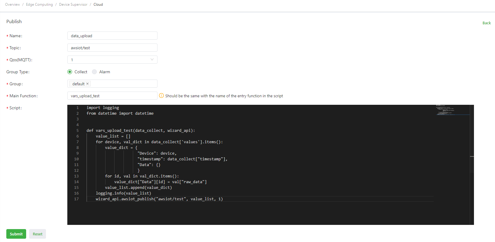
  
  The script is as follows:
  
  ```python
  import logging
  from datetime import datetime
  """
  Logs are generally generated in the gateway in the following ways:
  1. import logging: uses logging.info(XXX) to generate logs. Display of logs generated in this way is not controlled by the log level parameter on the global parameter page.
  2. from common.Logger import logger: uses logger.info(XXX) to generate logs. Display of logs generated in this way is controlled by the log level parameter on the global parameter page.
  """
  
  def vars_upload_test(data_collect, wizard_api): # Define the main publishing function.
      value_list = [] # Define the data list.
      for device, val_dict in data_collect['values'].items(): # Traverse the values dictionary. The dictionary contains the device name and the variables of the device.
          value_dict = { # Customize the data dictionary.
                        "Device": device,
                        "timestamp": data_collect["timestamp"],
                        "Data": {}
                        }
          for id, val in val_dict.items(): # Traverse variables and assign values for the Data dictionary.
              value_dict["Data"][id] = val["raw_data"]
          value_list.append(value_dict) # Add data in value_dict to value_list in sequence.
      logging.info(value_list) # Print data in value_list in app logs in the following format: [{'Device': 'S7-1200', 'timestamp': 1589538347.5604711, 'Data': {'Test1': False, 'Test2': 12}}].
      return value_list # Send value_list to the app, which then uploads it to the MQTT server by collection time. If it fails to be sent, cache the data and upload it to the MQTT server by collection time after the connection recovers.
  ```
  
  The message publishing parameters are described as follows:

  - `Name`: custom publication name.

  - `Topic`: publication topic, which must be consistent with the topic that the MQTT server subscribes to.

  - `Qos(MQTT)`: publication QoS, which is recommended to be consistent with that of the MQTT server.
  
    - `0`: The message is sent only once, without retry.
    - `1`: The message is sent at least once to ensure that it reaches the MQTT server.

  - `Group Type`: when publishing variable data, select **Collection**. Then, only **Collection Group** is available in `Group`. When publishing alarm data, select **Alarm**. Then, only **Alarm Group** is available in `Group`.

  - `Group`: after a group is selected, all variables in this group are uploaded to the MQTT server according to the publication configuration. If you select multiple groups, the script logic in the publication is executed for the variables in each group at the collection interval of the groups. <font color=#FF0000>The group must include variables. Otherwise, the script logic in the publication is not executed.</font>

  - `Main Function`: name of the main function (entry function), which must be consistent with that in the script.

  - `Script`: uses Python code to customize the packaging and processing logic. The main function parameters are as follows:
  
    - `Parameter 1`: same as `Parameter 1` in the main function of [Standard MQTT-Publishing](http://app.ig.inhandnetworks.com/en/latest/Device-Supervisor-User-Manual-EN.html#publish).
    - `Parameter 2`: AWS IoT API of the Device Supervisor. For details, see [Device Supervisor AWS IoT API Description](#aws-iot-api-interface-description-of-device-supervisor).

- Step 2: Subscribe to messages in the AWS IoT.
  
  Choose **AWS IoT > Test** and enter the IG902 publication topic in the **Subscription topic** text box. As an example, the topic is `awsiot/test`.
  
  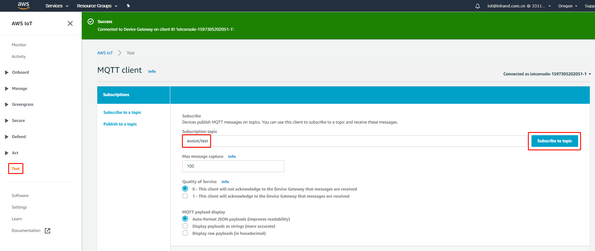
  
  

- Step 3: View the messages that the AWS IoT receives.
  
  After subscribing to the topic, you can view the message content under the topic.
  
  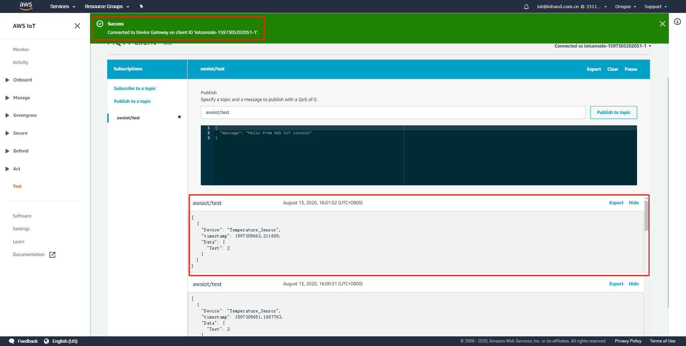

<a id="subscrip-aws-iot"> </a>

### 2.3 Subscribing to AWS IoT Messages

- Step 1: Configure the message for subscription.
  
  Choose **Cloud > Message Management** and add the message for subscription. The following figure shows the configuration:
  
  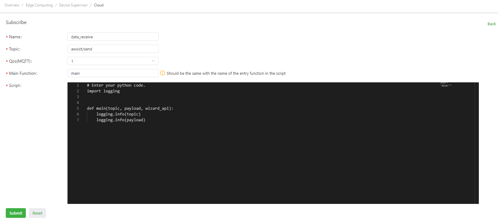
  
  The message subscription parameters are described as follows:
  
  - `Name`: custom subscription name.
  - `Topic`: subscription topic, which must be consistent with the data topic published by the MQTT server.
  - `Qos(MQTT)`: subscription QoS. The default value is 0.
  - `Main Function`: name of the main function (entry function), which must be consistent with that in the script.
  - `Script`: uses Python code to customize the packaging and processing logic. The main function parameters of custom topic subscription are as follows:
    - `Parameter 1`: received topic. The data type is `string`.
    - `Parameter 2`: received data. The data type is `string`.
    - `Parameter 3`: AWS IoT API of the Device Supervisor. For details, see [Device Supervisor AWS IoT API Description](#aws-iot-api-interface-description-of-device-supervisor).

- Step 2: Publish messages in the AWS IoT.
  
  Choose **AWS IoT > Test** and enter the IG902 subscription topic in the **Publish to topic** text box. As an example, the topic is `awsiot/send`.
  
  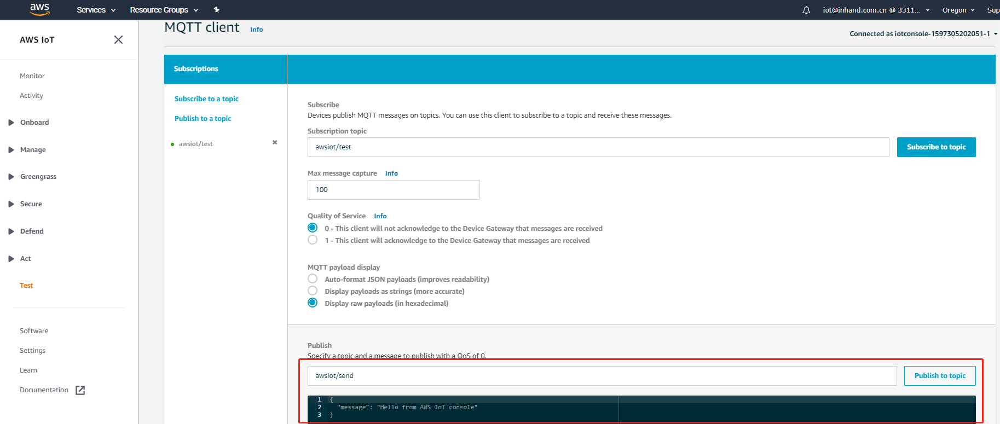
  
  

- Step 3: View the messages that the AWS IoT publishes.
  
  After the AWS IoT publishes messages, you can view the received messages in the run logs of the app.
  
  

<a id="appendix"> </a>

## Appendix

<a id="aws-iot-api-interface-description-of-device-supervisor"> </a>

### Device Supervisor AWS IoT API Description

For details about the basic configuration of `wizard_api`, see [Device Supervisor API Description](http://app.ig.inhandnetworks.com/en/latest/Device-Supervisor-User-Manual-EN.html#device-supervisor-api-description). If the cloud service type is `AWS IoT`, `wizard_api` additionally provides the following method:

- `awsiot_publish(topic, payload, qos)`
  - `Method Description`: data submitting method.
  
  - `Parameter`
    
    - `Parameter 1`: MQTT topic. The data type is `string`. This topic is used to send the data to the MQTT server.
    - `Parameter 2`: data to be sent.
    - `Parameter3`: QoS level. The options are 0 and 1.
  
  - `Usage example`:
    
    
    
    ```python
    import logging
    from datetime import datetime
    """
    Logs are generally generated in the gateway in the following ways:
    1. import logging: uses logging.info(XXX) to generate logs. Display of logs generated in this way is not controlled by the log level parameter on the global parameter page.
    2. from common.Logger import logger: uses logger.info(XXX) to generate logs. Display of logs generated in this way is controlled by the log level parameter on the global parameter page.
    """
    
    def vars_upload_test(data_collect, wizard_api): # Define the main publishing function.
        value_list = [] # Define the data list.
        for device, val_dict in data_collect['values'].items(): # Traverse the values dictionary. The dictionary contains the device name and the variables of the device.
            value_dict = { # Customize the data dictionary.
                          "Device": device,
                          "timestamp": data_collect["timestamp"],
                          "Data": {}
                          }
            for id, val in val_dict.items(): # Traverse variables and assign values for the Data dictionary.
                value_dict["Data"][id] = val["raw_data"]
            value_list.append(value_dict) # Add data in value_dict to value_list in sequence.
        logging.info(value_list) # Print data in value_list in app logs in the following format: [{'Device': 'S7-1200', 'timestamp': 1589538347.5604711, 'Data': {'Test1': False, 'Test2': 12}}].
        wizard_api.awsiot_publish("awsiot/test", value_list, 1) # Send value_list to the app, which then uploads it to the MQTT server by collection time. If it fails to be sent, cache the data and upload it to the MQTT server by collection time after the connection recovers.    
    ```